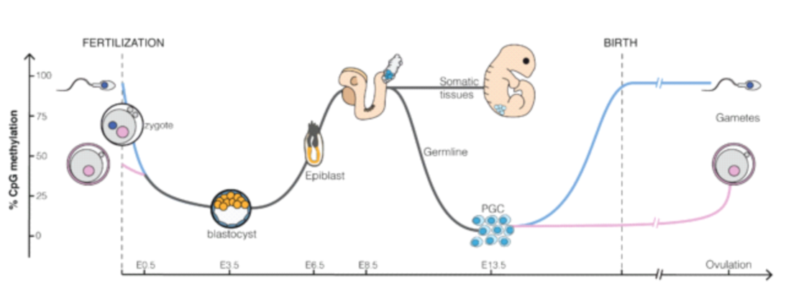
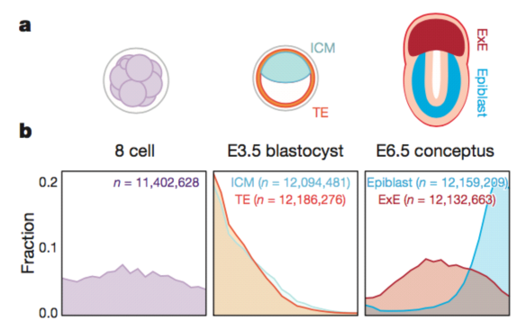
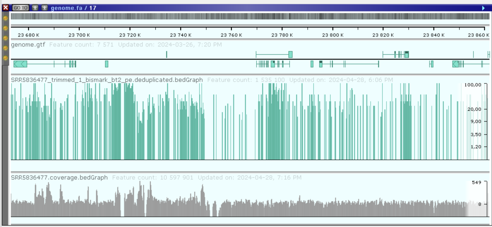
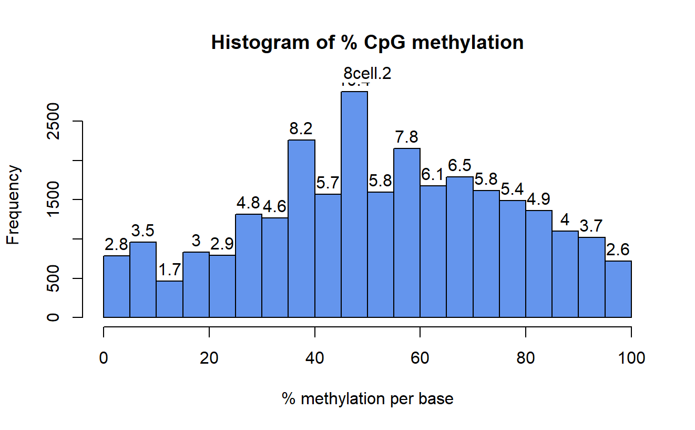
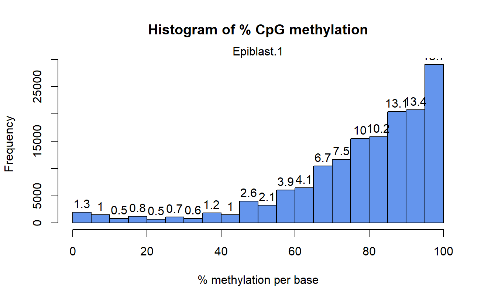
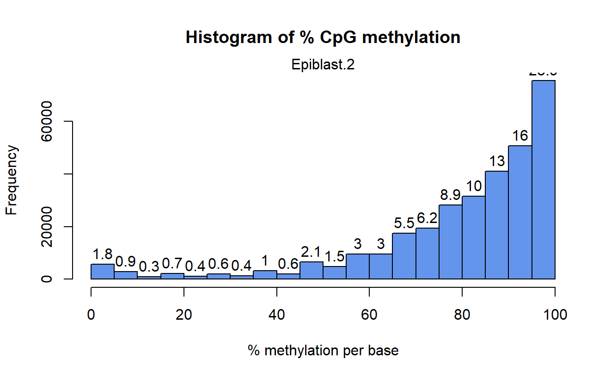
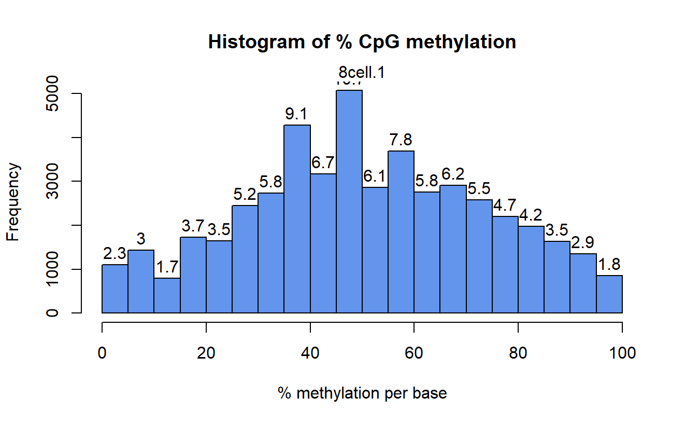

# Метилирование

# **Введение**

- Полезные материалы
    
    [10.5 Extracting interesting regions: Differential methylation and segmentation | Computational Genomics with R](https://compgenomr.github.io/book/extracting-interesting-regions-differential-methylation-and-segmentation.html)
    
    [DNA methylation data by sequencing: experimental approaches and recommendations for tools and pipelines for data analysis - Clinical Epigenetics](https://clinicalepigeneticsjournal.biomedcentral.com/articles/10.1186/s13148-019-0795-x)
    
    [Running Bismark - Bismark](https://felixkrueger.github.io/Bismark/bismark/)
    


Целью данного домашнего задания является изучение глобального изменения уровня CpG метилирования ДНК при раннем эмбриональном развитии мыши. Считается, что при развитии эмбриона происходят так называемые волны деметилирования-метилирования, т.е. на ранних стадиях CpG метилирование уменьшается до некоторого минимума (около 25%), а затем по мере дифференцировки тканей оно сильно увеличивается (около 90%) и остается таким на протяжении всей жизни организма:



Для выполнения данной задачи мы будем изучать следующие образцы WGBS (Whole genome bisulfite sequencing), соответствующие разным стадиям эмбрионального развития мыши:

- 8cell_rep1_WGBS – 8-клеточный эмбрион, примерно 2.25 дня после оплодотворения яйцеклетки
- ICM_rep1_WGBS – внутренняя клеточная масса бластоциста, примерно 3.5 дня после оплодотворения яйцеклетки
- Epiblast_rep1_WGBS – стадия эпибласта, примерно 6.5 дней после оплодотворения яйцеклетки

В соответствующей статье [PMID: 28959968] авторы приводят следующие распределения метилирования цитозинов:



# Подготовим рабочее пространство

Переда началом подготовим рабочее пространство, а именно создадим рабочую директорию и все необходимые вложенные файлы.

```bash
# Создадим рабочую дирректорию и переместимся в неё
$ mkdir -p omics_hw/methylation
$ cd omics_hw/methylation

# Cоздадим необходимые дирректории
$ mkdir fastq_files # дирректория с чистыми .fastq файлы
$ mkdir scripts # дирректория со скриптами с помощью которых мы будем обрабатывать данные
$ mkdir references # дирректория c геномным референсом, аннотацией и индексами для генома
$ mkdir fastq_trimmed # дирректория с триммироваными .fastq файлами
$ mkdir qc # дирректория с отчётами о качестве наших данных
```

# Скачивание файлов

Скачаем данные **SRP078328 ****при помощи [SRA Explorer](https://sra-explorer.info/#). Для этого создадим скрипт `load_fastq.sh` в дирректории `scripts`. Добавим `$1` перед названием файла чтобы указать необходимую нам директорию. А так же удалим конкатенированые файлы, которые по какой-то причине выдаёт нам SRA Explorer

```bash
#!/usr/bin/env bash
curl -L ftp://ftp.sra.ebi.ac.uk/vol1/fastq/SRR583/007/SRR5836477/SRR5836477_1.fastq.gz -o $1/SRR5836477_GSM2229984_TE_rep1_WGBS_Mus_musculus_Bisulfite-Seq_1.fastq.gz
curl -L ftp://ftp.sra.ebi.ac.uk/vol1/fastq/SRR583/007/SRR5836477/SRR5836477_2.fastq.gz -o $1/SRR5836477_GSM2229984_TE_rep1_WGBS_Mus_musculus_Bisulfite-Seq_2.fastq.gz
curl -L ftp://ftp.sra.ebi.ac.uk/vol1/fastq/SRR583/006/SRR5836476/SRR5836476_1.fastq.gz -o $1/SRR5836476_GSM2229983_ICM_rep2_WGBS_Mus_musculus_Bisulfite-Seq_1.fastq.gz
curl -L ftp://ftp.sra.ebi.ac.uk/vol1/fastq/SRR583/006/SRR5836476/SRR5836476_2.fastq.gz -o $1/SRR5836476_GSM2229983_ICM_rep2_WGBS_Mus_musculus_Bisulfite-Seq_2.fastq.gz
curl -L ftp://ftp.sra.ebi.ac.uk/vol1/fastq/SRR583/004/SRR5836474/SRR5836474_1.fastq.gz -o $1/SRR5836474_GSM2229981_8cell_rep2_WGBS_Mus_musculus_Bisulfite-Seq_1.fastq.gz
curl -L ftp://ftp.sra.ebi.ac.uk/vol1/fastq/SRR583/004/SRR5836474/SRR5836474_2.fastq.gz -o $1/SRR5836474_GSM2229981_8cell_rep2_WGBS_Mus_musculus_Bisulfite-Seq_2.fastq.gz
curl -L ftp://ftp.sra.ebi.ac.uk/vol1/fastq/SRR583/005/SRR5836475/SRR5836475_1.fastq.gz -o $1/SRR5836475_GSM2229982_ICM_rep1_WGBS_Mus_musculus_Bisulfite-Seq_1.fastq.gz
curl -L ftp://ftp.sra.ebi.ac.uk/vol1/fastq/SRR583/005/SRR5836475/SRR5836475_2.fastq.gz -o $1/SRR5836475_GSM2229982_ICM_rep1_WGBS_Mus_musculus_Bisulfite-Seq_2.fastq.gz
curl -L ftp://ftp.sra.ebi.ac.uk/vol1/fastq/SRR382/002/SRR3824222/SRR3824222_1.fastq.gz -o $1/SRR3824222_GSM2229986_Epiblast_rep1_WGBS_Mus_musculus_Bisulfite-Seq_1.fastq.gz
curl -L ftp://ftp.sra.ebi.ac.uk/vol1/fastq/SRR382/002/SRR3824222/SRR3824222_2.fastq.gz -o $1/SRR3824222_GSM2229986_Epiblast_rep1_WGBS_Mus_musculus_Bisulfite-Seq_2.fastq.gz
curl -L ftp://ftp.sra.ebi.ac.uk/vol1/fastq/SRR583/003/SRR5836473/SRR5836473_1.fastq.gz -o $1/SRR5836473_GSM2229980_8cell_rep1_WGBS_Mus_musculus_Bisulfite-Seq_1.fastq.gz
curl -L ftp://ftp.sra.ebi.ac.uk/vol1/fastq/SRR583/003/SRR5836473/SRR5836473_2.fastq.gz -o $1/SRR5836473_GSM2229980_8cell_rep1_WGBS_Mus_musculus_Bisulfite-Seq_2.fastq.gz
curl -L ftp://ftp.sra.ebi.ac.uk/vol1/fastq/SRR583/008/SRR5836478/SRR5836478_1.fastq.gz -o $1/SRR5836478_GSM2229985_TE_rep2_WGBS_Mus_musculus_Bisulfite-Seq_1.fastq.gz
curl -L ftp://ftp.sra.ebi.ac.uk/vol1/fastq/SRR583/008/SRR5836478/SRR5836478_2.fastq.gz -o $1/SRR5836478_GSM2229985_TE_rep2_WGBS_Mus_musculus_Bisulfite-Seq_2.fastq.gz
curl -L ftp://ftp.sra.ebi.ac.uk/vol1/fastq/SRR382/004/SRR3824224/SRR3824224_1.fastq.gz -o $1/SRR3824224_GSM2229988_ExE_rep1_WGBS_Mus_musculus_Bisulfite-Seq_1.fastq.gz
curl -L ftp://ftp.sra.ebi.ac.uk/vol1/fastq/SRR382/004/SRR3824224/SRR3824224_2.fastq.gz -o $1/SRR3824224_GSM2229988_ExE_rep1_WGBS_Mus_musculus_Bisulfite-Seq_2.fastq.gz
curl -L ftp://ftp.sra.ebi.ac.uk/vol1/fastq/SRR382/005/SRR3824225/SRR3824225_1.fastq.gz -o $1/SRR3824225_GSM2229989_ExE_rep2_WGBS_Mus_musculus_Bisulfite-Seq_1.fastq.gz
curl -L ftp://ftp.sra.ebi.ac.uk/vol1/fastq/SRR382/005/SRR3824225/SRR3824225_2.fastq.gz -o $1/SRR3824225_GSM2229989_ExE_rep2_WGBS_Mus_musculus_Bisulfite-Seq_2.fastq.gz
curl -L ftp://ftp.sra.ebi.ac.uk/vol1/fastq/SRR583/009/SRR5836479/SRR5836479_1.fastq.gz -o $1/SRR5836479_GSM2229987_Epiblast_rep2_WGBS_Mus_musculus_Bisulfite-Seq_1.fastq.gz
curl -L ftp://ftp.sra.ebi.ac.uk/vol1/fastq/SRR583/009/SRR5836479/SRR5836479_2.fastq.gz -o $1/SRR5836479_GSM2229987_Epiblast_rep2_WGBS_Mus_musculus_Bisulfite-Seq_2.fastq.gz
```

Скачаем `.fastq` файлы для нужных нам образцов

```bash
$ bash scripts/load_fastq.sh fastq_files
```

Переименуем файлы чтобы с ними было проще работать. Для этого сделаем небольшой скрипт на `python` 

```python
import os
import glob

dir_name = 'fastq_files'
for filename in glob.glob(f'{dir_name}/*'):
    sra_code = filename.split('/')[1].split('_')[0]
    new_name = f'{dir_name}/{sra_code}.fastq.gz'
    os.rename(filename, new_name)
    print(sra_code)

```

Запустим скрипт

```bash
$ python3 scripts/rename_fastq.py
```

# QC для сырых образцов

В этот раз будем запускать все тулы при помощи `singularity`. Для этого нужно активировать модуль `singularity` на кластере. Скачивать образы тулов будем по мере необходимости.

<aside>
💡 Аналогично можно работать и с `docker`

</aside>

Подгрузим модуль и скачаем образы необходимых тулов. Названия для образов я обычно нахожу на сайте [bioconda](https://bioconda.github.io/recipes/fastqc/README.html) переходя по ссылке `quay.io/biocontainers/<toolname>` . Например вот [здесь](https://quay.io/repository/biocontainers/fastqc?tab=tags&tag=latest) можно посмотреть образы для `fastqc`

```jsx
$ module load singularity/3.6.1
$ mkdir singularityImages
$ singularity pull --dir singularityImages fastqc.sif docker://quay.io/biocontainers/fastqc:0.12.1--hdfd78af_0
$ singularity pull --dir singularityImages multiqc.sif docker://quay.io/biocontainers/multiqc:1.21--pyhdfd78af_0
```

Теперь сделаем файл с запуском анализа качества прочтений.

```bash
#!/bin/bash
#PBS -N quality_control
#PBS -l walltime=2:30:00
#PBS -l nodes=1:ppn=8

### Change directory
cd ~/compbio/methylation

### Load singularity
module load singularity/3.6.1 

### Run QC
singularity run singularityImages/fastqc.sif fastqc -o qc -t 8 fastq_files/*.fastq.gz
singularity run singularityImages/multiqc.sif multiqc qc --outdir qc --filename multiqc.html --title "Read quality" --force
```

Запустим скрипт на вычислительной ноде при помощи `qsub`

```bash
$ qsub scripts/run_qc.sh
```

- *Результаты*
    
    [multiqc_report.html](figures/multiqc_report.html)
    

# Тримминг

Будем делать тримминг при помощи `fastp`. Скачаем его образ

```bash
$ singularity pull --dir singularityImages fastp.sif docker://quay.io/biocontainers/fastp:0.23.4--hadf994f_3
```

Нам нужно будет создать два отдельных скрипта: один который будет отправлять запросы на вычислительную ноду для каждого образца, и второй, который будет выполнять тримминг. Так мы сможем задействовать несколько нод одновременно.

Тримминг будем делать только по среднему качеству и минимальной длине как это делает при базовых настройках `trim-galore`

```bash
#!/bin/bash
#PBS -l walltime=10:30:00
#PBS -l nodes=1:ppn=8

### Change directory
cd ~/compbio/methylation

### Load singularity
module load singularity/3.6.1 

### Trimming
singularity run singularityImages/fastp.sif fastp -i fastq_files/${SAMPLE}_1.fastq.gz -I fastq_files/${SAMPLE}_2.fastq.gz \
-o fastq_trimmed/${SAMPLE}_trimmed_1.fastq.gz -O fastq_trimmed/${SAMPLE}_trimmed_2.fastq.gz \
-h qc/${SAMPLE}_fastp.html -j qc/${SAMPLE}_fastp.json --average_qual 20 --length_required 20 -w 8
```

Теперь запустим выполнение скрипта для всех образцов

```bash
$ for infile in fastq_files/*1.fastq.gz
	do
	  base=$(basename -a -s _1.fastq.gz ${infile})
	  echo ${base}
	  qsub -v SAMPLE=$base -N $base scripts/trim.sh
	done
```

Объединим результаты `fastp` в один отчёт

```bash
$ singularity run singularityImages/multiqc.sif multiqc . -f -d -dd 3 --outdir qc --filename mutiqc_report.html --force --no-data-dir
```

- Результаты
    
    [multiqc_report.html](figures/multiqc_report.html)
    

# Bismark

## Скачаем файлы с референсом

Составим скрипт для скачивания

```bash
#!/bin/bash

# скачаем сборку 17-ой хромосомы
wget https://ftp.ensembl.org/pub/release-111/fasta/mus_musculus/dna/Mus_musculus.GRCm39.dna.chromosome.17.fa.gz
gzip -d Mus_musculus.GRCm39.dna.chromosome.17.fa.gz
mv Mus_musculus.GRCm39.dna.chromosome.17.fa references/chr17.fa

# скачаем геномную аннотацию с ENSEMBL
wget https://ftp.ensembl.org/pub/release-111/gtf/mus_musculus/Mus_musculus.GRCm39.111.gtf.gz
gzip -d Mus_musculus.GRCm39.111.gtf.gz
mv Mus_musculus.GRCm39.111.gtf references/genome.gtf
```

Запустим скрипт

```bash
$ bash scripts/load_reference.sh
```

## Картирование

Скачаем образ для `bismark`

```bash
$ singularity pull --dir singularityImages bismark.sif docker://quay.io/biocontainers/bismark:0.24.2--hdfd78af_0
```

Проиндексируем геном. Тут нужно быть осторожным с параметром `-p` т.к. он задаёт в два раза больше доступных потоков (параллельно индексируется геном для двух замен)

```bash
$ singularity run singularityImages/bismark.sif bismark_genome_preparation --verbose --parallel 16 references/
```

Теперь напишем скрипт для картирования наших образцов.

```bash
#!/bin/bash
#PBS -l walltime=10:30:00
#PBS -l nodes=1:ppn=8

### Change directory
cd ~/compbio/methylation

### Make output dir
mkdir -p bismarkOutput/${SAMPLE}

### Load singularity
module load singularity/3.6.1 

### Alignment
singularity run singularityImages/bismark.sif bismark --parallel -p 4 --gzip  references  -1 fastq_trimmed/${SAMPLE}_trimmed_1.fastq.gz  -2 fastq_trimmed/${SAMPLE}_trimmed_2.fastq.gz --output_dir bismarkOutput/${SAMPLE} &> bismarkOutput/${SAMPLE}/bismark.log 
```

<aside>
💡 Стоит быть осторожным с указанием`--parallel` и `-p` флагов. Стандартно бисмарк для каждого сэмпла выполняет по 2 выравнивания (т.к. считает, что протокол направленный/stranded). Соответственно, он будет использовать **2 * parallel * p** потоков.

`--parallel` — число инстансов `bismark` которые будут запущены параллельно (делит           `.fastq` файл на части и запускает `bismark` на каждой части по отдельности)
`-p`  — число потоков, которые использует bowtie при выравнивании

Так же разработчики просят не использовать высокие значения `-p` так как это может приводить к нестабильностям в работе.

</aside>

Теперь запустим выполнение скрипта для всех образцов

```bash
$ for infile in fastq_files/*1.fastq.gz
	do
	  base=$(basename -a -s _1.fastq.gz ${infile})
	  echo ${base}
	  qsub -v SAMPLE=$base -N $base scripts/bismark_align.sh
	done
```

Посмотрим на один из .bam файлов. Для этого воспользуемся командой `samtools view`  (он уже установлен в образе `bismark` так что можно дополнительно не скачивать)

```bash
$ singularity run singularityImages/bismark.sif samtools view bismarkOutput/SRR3824224/SRR3824224_trimmed_1_bismark_bt2_pe.bam | head -n 5

SRR3824225.1_1/1        83      17      76346865        0       140M    =       76346848   -157     AACAAATAAAATAAAAACAAAATAAACCTTTAATAACCTTAAAAAAAATAACTACCCCTCTTTTATTTTAAAAAACCAATTCTTTAAAATACAATAAACACATTCAACTATTCCTTATCCCATAAAATTATAAAAAATTC        ????????????????????????????????????????????????????????????????????????????????????????????????????????????????????????????????????????????    NM:i:39 MD:Z:0G8G0G1G2G0G3G0G1G0G0G5G0G1G5G0G0G0G0G1T3G2G10G9G12G0G1G1G2G1G3G14G6G0G0G0G2G3G0G5     XM:Z:h........hh.h..hh...hh.hhh.....hh.h.....hhhhh.....h..x..........h.........h............hh.h.z..h.h...z..............h......hhhh..h...hh.....   XR:Z:CT     XG:Z:GA
SRR3824225.1_1/1        163     17      76346848        0       140M    =       76346865   157      GAGGACAAAAAATTTAAAACAAATAAAATAAAAACAAAATAAACCTTTAATAACCTTAAAAAAAATAACTACCCCTCTTTTATTTTAAAAAACCAATTCTTTAAAATACAATAAACACATTCAACTATTCCTTATCCCAT        ????????????????????????????????????????????????????????????????????????????????????????????????????????????????????????????????????????????    NM:i:37 MD:Z:1T1T0G3G7G0G8G0G1G2G0G3G0G1G0G0G5G0G1G5G0G0G0G0G1T3G2G10G9G12G0G1G1G2G1G3G14G6 XM:Z:X.H.h...h.......hh........hh.h..hh...hh.hhh.....hh.h.....hhhhh.....h..x..........h.........h............hh.h.z..h.h...z..............h......   XR:Z:GA XG:Z:GA
SRR3824225.26_26/1      99      17      41386106        0       140M    =       41386123   157      AAATTTTAAATTAGATTGAAGGTTATGTGTTGGAATGTTTTGGGAATGAAGATAGTAGTTGTTATTTGTGTGTTTTAGGGGGGTGGGGATGTATATTTATTGGTTCGGTTGGAGAATGTTGCTTAATTTGTTTGAAAAAT        ????????????????????????????????????????????????????????????????????????????????????????????????????????????????????????????????????????????    NM:i:30 MD:Z:6C4C3C0C5C0C5C8C0C7A7C5C0C1C0C6C1C10C5C4C0C0G0C4C3C12A4C0C2C8C0        XM:Z:......h....x...xz.....hh.....x........hx...............x.....hh.hx......h.h................h....xz.x....xZ..x.................hx..h........h   XR:Z:CT XG:Z:CT
SRR3824225.26_26/1      147     17      41386123        0       140M    =       41386106   -157     GAAGGTTATGTGTTGGAATGTTTTGGGAATGAAGATAGTAGTTGTTATTTGTGTGTTTTAGGGGGGTGGGGATGTATATTTATTGGTTCGGTTGGAGAATGTTGATTAATTTGTTTGAAAAATAAAATTTAGATAGTGAG        ????????????????????????????????????????????????????????????????????????????????????????????????????????????????????????????????????????????    NM:i:27 MD:Z:5C0C5C8C0C7A7C5C0C1C0C6C1C10C5C4C0C0G0C4C3C17C0C2C8C5C4C6      XM:Z:.....hh.....x........hx...............x.....hh.hx......h.h................h....xz.x....xZ..x.................hx..h........h.....h....x......   XR:Z:GA XG:Z:CT
SRR3824225.28_28/1      99      17      41386053        0       140M    =       41386120   207      ATTAAAATAAAAATTAATTTTTTATTTGTTTTTTTAGTTTTTTTGGTAAATTTAAATTTTAAATTAGATTGAAGGTTACGTGTTGGAATGTTTTGGGAATGAAGATAGTAGTTGTTATTTGTGTGTTTTACGGGGGTGGG        ????????????????????????????????????????????????????????????????????????????????????????????????????????????????????????????????????????????    NM:i:35 MD:Z:2C10C0C3C1C4C2C1C2C3C0C0C1C8C0C7C4C3C0C5C0C1T3C8C0C7A7C5C0C1C0C6C1C2G7C1       XM:Z:..h..........hh...h.h....x..h.h..h...hhh.h........hh.......h....x...xz.....hh.....x........hx...............x.....hh.hx......h.h............   XR:Z:CT XG:Z:CT
```

Видно, что несмотря на странные названия файлов и ридов .bam файлы содержат и прямые и обратные прочтения. Описание флагов ридов (вторая колонка) можно посмотреть вот здесь

[Explain SAM Flags](https://broadinstitute.github.io/picard/explain-flags.html)

## Дедупликация

Теперь сделаем дедупликацию чтобы убрать возможные артефакты PCR

```bash
#!/bin/bash

# Load singularity
module load singularity/3.6.1

# Dedupliaction step
for infile in bismarkOutput/*/*.bam
do
    base=$(basename -a -s _trimmed_1_bismark_bt2_pe.bam ${infile})
    echo ${base}
    singularity run singularityImages/bismark.sif deduplicate_bismark -p --output_dir bismarkOutput/${base} $infile
done
```

Запустим выполнение дедупликации

```bash
$ bash scripts/deduplicate.sh
```

## Получение профиля метилирования ДНК

Для извлечения информации о метилировании цитозинов по всему геному из полученных выравниваний запускается программа `bismark_methylation_extractor`

```bash
#!/bin/bash

# Load singularity
module load singularity/3.6.1

# Methylatioin calling step
for infile in bismarkOutput/*/*deduplicated.bam
do
    base=$(basename -a -s _trimmed_1_bismark_bt2_pe.deduplicated.bam ${infile})
    echo ${base}
    singularity run singularityImages/bismark.sif bismark_methylation_extractor -p --output_dir bismarkOutput/${base} \
    --no_overlap --gzip --bedGraph --cytosine_report $infile
done
```

Создадим директорию с аутпутом и запустим скрипт

```bash
$ mkdir methylationOutput
$ bash scripts/methcall.sh
```

## Создание отчёта

Запутим `multiqc` чтобы собрать результаты вместе

```bash
$ singularity run singularityImages/multiqc.sif multiqc . -f -d -dd 3 --outdir qc --filename bismark_report.html --force --no-data-dir
```

- *Результат*
    
    [bismark_report.html](figures/bismark_report.html)
    

## Извлечем информацию о метилировании в CpG контексте

## Визуализация в геномном браузере

Скачаем образ для `bedtools`

```bash
$ singularity pull --dir singularityImages bedtools.sif docker://quay.io/biocontainers/bedtools:2.31.1--hf5e1c6e_1
```

Теперь создадим `.bedGraph` файлы, которые содержат информацию о покрытии. Для этого отсортируем `.bam` файлы и воспользуемся тулом `genomecov`

```bash
#!/bin/bash

for file in bismarkOutput/*/*.deduplicated.bam
do
    base=$(basename -a -s _trimmed_1_bismark_bt2_pe.deduplicated.bam ${file})
    singularity run singularityImages/samtools.sif samtools sort -@16 $file -o bismarkOutput/${base}/${base}.deduplicated.sorted.bam
    singularity run singularityImages/bedtools.sif bedtools genomecov \
    -ibam bismarkOutput/${base}/${base}.deduplicated.sorted.bam -bg > bismarkOutput/${base}/${base}.coverage.bedGraph
done
```

Запустим скрипт

```bash
$ bash scripts/bedGraph_coverage.sh
```

Теперь скопируем .bedGraph файлы в от дельную папку, разархивируем (те которые архивированы) и скачаем на компьютер.

  

```bash
$ mkdir bismarkBedGraph # создание новой директории
$ cp bismarkOutput/*/*.bedGraph* bismarkBedGraph/ # копирование .bedGraph Файлов бисмарка
$ for file in bismarkBedGraph/*.gz; do gzip -d $file; done # разархивируем файлы
$ tar -cvf bismarkBedGraph.tar bismarkBedGraph/*
```

Теперь загрузим все файлы (геном мышки + `.bedGraph`) на сайте персефоны



# Анализ дифференциального метилирования

## Подготовка

Будем сравнивать `8cell vs Epiblast` 

| 8cell | Epiblast |
| --- | --- |
| SRR5836474 | SRR3824222 |
| SRR5836473 | SRR5836479 |

У нас достаточно высокая глубина секвенирования для наших образцов. Поэтому можно использовать тулы, которые не делают сглаживание. Попробуем использовать `methylKit` т.к. к нему есть неплохая документация

- Полезные материалы
    
    [DNA Methylation Analysis using methylKit](https://rosericazondekon.github.io/posts/methylkit-dna-methylation-analysis/)
    
    [10.5 Extracting interesting regions: Differential methylation and segmentation | Computational Genomics with R](https://compgenomr.github.io/book/extracting-interesting-regions-differential-methylation-and-segmentation.html)
    
    [methylKit.knit](https://www.bioconductor.org/packages/release/bioc/vignettes/methylKit/inst/doc/methylKit.html#57_methSeg():_segmentation_of_methylation_or_differential_methylation_profiles)
    

## Анализ

[https://github.com/Claptar/methylation_mipt/blob/master/methylkit.Rmd](https://github.com/Claptar/methylation_mipt/blob/master/methylkit.Rmd)

Установим необходимые библиотеки

```r
if (!require("BiocManager", quietly = TRUE))
    install.packages("BiocManager")

BiocManager::install("methylKit")
BiocManager::install("biomaRt")
```

Подгрузим библиотеки

```r
library(methylKit)
library(biomaRt)
```

Подгрузим файлы

```r
file.list = list(
'bismarkMethylation/SRR5836473_trimmed_1_bismark_bt2_pe.deduplicated.bismark.cov',
'bismarkMethylation/SRR5836474_trimmed_1_bismark_bt2_pe.deduplicated.bismark.cov',
'bismarkMethylation/SRR3824222_trimmed_1_bismark_bt2_pe.deduplicated.bismark.cov',
'bismarkMethylation/SRR5836479_trimmed_1_bismark_bt2_pe.deduplicated.bismark.cov'
)
```

```r
# Read the files into a methylKit object of type methylRawList: myobj
myobj = methRead(file.list,
                 pipeline="bismarkCoverage",
                 sample.id=list("8cell.1","8cell.2","Epiblast.1","Epiblast.2"),
                 assembly="mm10",
                 treatment=c(0, 0, 1, 1),
                 context="CpG",
                 )
```

Посмотрим на распределение метилированых сайтов

```r
getMethylationStats(myobj[[1]],plot=TRUE,both.strands=FALSE)
getMethylationStats(myobj[[2]],plot=TRUE,both.strands=FALSE)
getMethylationStats(myobj[[3]],plot=TRUE,both.strands=FALSE)
getMethylationStats(myobj[[4]],plot=TRUE,both.strands=FALSE)
```

- Результат
    
    
    
    
    
    
    
    
    

Фильтрация и объединение файлов

```r
# Filter out CpG sites with too few or too many reads
filtered.myobj = filterByCoverage(myobj, lo.count=10, lo.perc=NULL, hi.count=NULL, hi.perc=99.9)

# Generate methylation matrix by combining all samples. By default it includes only those CpGs which are covered by reads in each sample.
meth = unite(filtered.myobj) 
```

Посмотрим на корреляцию образцов

```r
getCorrelation(meth,plot=TRUE)
```

- Результат
    
    
    

Сделаем PCA

```r
pc = PCASamples(meth, obj.return=TRUE, adj.lim=c(1,1))
```

- Результат
    
    
    

Анализ дифференциального метилирования будем делать при помощи хи-квадрата

```r
# Run differential analysis 
myDiff = calculateDiffMeth(meth, test = "Chisq", overdispersion ='MN')
```

Оставим только значимые сайты

```r
# The "difference" parameter sets the percentage threshold for differences in methylation levels
myDiff25 = getMethylDiff(myDiff, difference=25, qvalue=0.001)
myDiff25
```

|  | chr<int> | start<int> | end<int> | strand<chr> | pvalue<dbl> | qvalue<dbl> | meth.diff<dbl> |
| --- | --- | --- | --- | --- | --- | --- | --- |
| 3 | 17 | 3119156 | 3119156 | * | 1.214907e-04 | 2.114906e-04 | 29.26235 |
| 5 | 17 | 3119164 | 3119164 | * | 5.827433e-07 | 2.048513e-06 | 36.32017 |
| 6 | 17 | 3119191 | 3119191 | * | 1.008455e-04 | 1.801668e-04 | 38.06514 |
| 12 | 17 | 3127785 | 3127785 | * | 5.231073e-10 | 3.844921e-09 | 39.80856 |
| 13 | 17 | 3127786 | 3127786 | * | 1.862772e-04 | 3.056103e-04 | 28.55392 |

Сделаем аннотацию дифференциально метилированых сайтов. Для этого скачаем аннотацию Ensembl

```r
# Download genomic annotation for particular version of genome assembly (mm10)
# Might take a while, depends on cluster traffic load

ensembl111 <- useEnsembl(biomart = 'genes', dataset = 'mmusculus_gene_ensembl', version=111)

# Get genes annotation - TSSs and chromosomes
g <- getBM(attributes=c('ensembl_gene_id','chromosome_name',"transcription_start_site"), mart = ensembl111)

# Annotation contains several TSSs for some genes, but we want to keep only one for convenience
# This will not affect the results, because each CpG will be assigned to the closest TSS
g=g[!duplicated(g[, c("ensembl_gene_id")], fromLast=F),]
```

Создадим GRanges объект

```r
# Make a GRanges object from the genes table
genes_all = makeGRangesFromDataFrame(g,
                                     keep.extra.columns=T,
                                     ignore.strand=T,
                                     seqinfo=NULL,
                                     seqnames.field=c("chromosome_name"),
                                     start.field="transcription_start_site",
                                     end.field=c("transcription_start_site"))
```

```r
# Make a GRanges object from the table with strong differentially methylated CpGs
mydiff25_ranges = makeGRangesFromDataFrame(myDiff25, keep.extra.columns=F)
mydiff25_ranges
>>>
GRanges object with 6490 ranges and 0 metadata columns:
        seqnames    ranges strand
           <Rle> <IRanges>  <Rle>
      3       17   3119156      *
      5       17   3119164      *
      6       17   3119191      *
     12       17   3127785      *
     13       17   3127786      *
    ...      ...       ...    ...
  26410       17  95149391      *
  26411       17  95149489      *
  26412       17  95149490      *
  26413       17  95149502      *
  26414       17  95149503      *
```

Для каждого сайта найдём ближайшие транскрипты

```r
# Find the nearest TSS for each CpG
x = nearest(mydiff25_ranges, genes_all)

myDiff25['nearest_tss'] = g[x,'transcription_start_site']
myDiff25['nearest_gene'] = g[x,'ensembl_gene_id']

myDiff25_x1 = myDiff25[myDiff25$meth.diff>0,]
myDiff25_x2 = myDiff25[myDiff25$meth.diff<0,]

myDiff25
```

|  | chr | start | end | strand | pvalue | qvalue | meth.diff | nearest_tss | nearest_gene |
| --- | --- | --- | --- | --- | --- | --- | --- | --- | --- |
| 3 | 17 | 3119156 | 3119156 | * | 0.0001214907421 | 0.0002114906346 | 29.26234505 | 3108194 | ENSMUSG00000088244 |
| 5 | 17 | 3119164 | 3119164 | * | 5.83E-07 | 2.05E-06 | 36.32016632 | 3108194 | ENSMUSG00000088244 |
| 6 | 17 | 3119191 | 3119191 | * | 0.0001008454984 | 0.0001801667755 | 38.06514341 | 3108194 | ENSMUSG00000088244 |
| 12 | 17 | 3127785 | 3127785 | * | 5.23E-10 | 3.84E-09 | 39.80855856 | 3134315 | ENSMUSG00000121378 |
| 13 | 17 | 3127786 | 3127786 | * | 0.0001862772295 | 0.0003056103415 | 28.55392157 | 3134315 | ENSMUSG00000121378 |

Сохраним результаты в отдельный файл

```r
write.csv(myDiff25, "results.csv")
```

Посмотрим на гены для которых есть 4 или больше CpG

```r
# Find genes with 4 or more CpGs assigned.
gene_diffMeth_x1 = table(myDiff25_x1$nearest_gene)
gene_diffMeth_x1 = names(gene_diffMeth_x1[gene_diffMeth_x1>=4])
head(gene_diffMeth_x1, 5)
>>>
"ENSMUSG00000000127" "ENSMUSG00000002017" "ENSMUSG00000002617" "ENSMUSG00000003279" "ENSMUSG00000003929"
```

```r
# Find genes with 4 or more CpGs assigned.
gene_diffMeth_x2 = table(myDiff25_x2$nearest_gene)
gene_diffMeth_x2 = names(gene_diffMeth_x2[gene_diffMeth_x2>=4])
gene_diffMeth_x2
>>>
"ENSMUSG00000117496"
```

```r
sessionInfo()
>>>
R version 4.3.3 (2024-02-29 ucrt)
Platform: x86_64-w64-mingw32/x64 (64-bit)
Running under: Windows 11 x64 (build 22631)

Matrix products: default

locale:
[1] LC_COLLATE=Russian_Belarus.utf8  LC_CTYPE=Russian_Belarus.utf8    LC_MONETARY=Russian_Belarus.utf8
[4] LC_NUMERIC=C                     LC_TIME=Russian_Belarus.utf8    

time zone: Europe/Moscow
tzcode source: internal

attached base packages:
[1] stats4    stats     graphics  grDevices datasets  utils     methods   base     

other attached packages:
[1] BiocManager_1.30.22  biomaRt_2.58.2       methylKit_1.28.0     GenomicRanges_1.54.1 GenomeInfoDb_1.38.8 
[6] IRanges_2.36.0       S4Vectors_0.40.2     BiocGenerics_0.48.1 

loaded via a namespace (and not attached):
  [1] RColorBrewer_1.1-3          jsonlite_1.8.8              magrittr_2.0.3              farver_2.1.1               
  [5] fs_1.6.4                    BiocIO_1.12.0               zlibbioc_1.48.2             vctrs_0.6.5                
  [9] memoise_2.0.1               Rsamtools_2.18.0            RCurl_1.98-1.14             ggtree_3.10.1              
 [13] progress_1.2.3              S4Arrays_1.2.1              curl_5.2.1                  SparseArray_1.2.4          
 [17] gridGraphics_0.5-1          KernSmooth_2.23-22          plyr_1.8.9                  cachem_1.0.8               
 [21] GenomicAlignments_1.38.2    igraph_2.0.3                lifecycle_1.0.4             pkgconfig_2.0.3            
 [25] Matrix_1.6-5                R6_2.5.1                    fastmap_1.1.1               gson_0.1.0                 
 [29] MatrixGenerics_1.14.0       GenomeInfoDbData_1.2.11     digest_0.6.35               numDeriv_2016.8-1.1        
 [33] aplot_0.2.2                 enrichplot_1.22.0           colorspace_2.1-0            patchwork_1.2.0            
 [37] AnnotationDbi_1.64.1        RSQLite_2.3.6               filelock_1.0.3              fansi_1.0.6                
 [41] mgcv_1.9-1                  abind_1.4-5                 httr_1.4.7                  polyclip_1.10-6            
 [45] compiler_4.3.3              bit64_4.0.5                 withr_3.0.0                 BiocParallel_1.36.0        
 [49] viridis_0.6.5               DBI_1.2.2                   ggforce_0.4.2               R.utils_2.12.3             
 [53] MASS_7.3-60.0.1             rappdirs_0.3.3              DelayedArray_0.28.0         rjson_0.2.21               
 [57] HDO.db_0.99.1               gtools_3.9.5                tools_4.3.3                 ape_5.8                    
 [61] scatterpie_0.2.2            R.oo_1.26.0                 glue_1.7.0                  restfulr_0.0.15            
 [65] nlme_3.1-164                GOSemSim_2.28.1             grid_4.3.3                  shadowtext_0.1.3           
 [69] reshape2_1.4.4              fgsea_1.28.0                generics_0.1.3              gtable_0.3.5               
 [73] R.methodsS3_1.8.2           tidyr_1.3.1                 hms_1.1.3                   data.table_1.15.4          
 [77] xml2_1.3.6                  tidygraph_1.3.1             utf8_1.2.4                  XVector_0.42.0             
 [81] ggrepel_0.9.5               pillar_1.9.0                stringr_1.5.1               yulab.utils_0.1.4          
 [85] fastseg_1.48.0              emdbook_1.3.13              limma_3.58.1                splines_4.3.3              
 [89] dplyr_1.1.4                 tweenr_2.0.3                BiocFileCache_2.10.2        treeio_1.26.0              
 [93] lattice_0.22-5              renv_1.0.7                  rtracklayer_1.62.0          bit_4.0.5                  
 [97] tidyselect_1.2.1            GO.db_3.18.0                Biostrings_2.70.3           knitr_1.46                 
[101] gridExtra_2.3               SummarizedExperiment_1.32.0 xfun_0.43                   graphlayouts_1.1.1         
[105] Biobase_2.62.0              statmod_1.5.0               matrixStats_1.3.0           stringi_1.8.3              
[109] lazyeval_0.2.2              ggfun_0.1.4                 yaml_2.3.8                  codetools_0.2-19           
[113] bbmle_1.0.25.1              ggraph_2.2.1                tibble_3.2.1                qvalue_2.34.0              
[117] ggplotify_0.1.2             cli_3.6.2                   munsell_0.5.1               Rcpp_1.0.12                
[121] dbplyr_2.5.0                coda_0.19-4.1               png_0.1-8                   bdsmatrix_1.3-7            
[125] XML_3.99-0.16.1             parallel_4.3.3              ggplot2_3.5.1               blob_1.2.4                 
[129] prettyunits_1.2.0           clusterProfiler_4.10.1      mclust_6.1                  DOSE_3.28.2                
[133] bitops_1.0-7                viridisLite_0.4.2           mvtnorm_1.2-4               tidytree_0.4.6             
[137] scales_1.3.0                purrr_1.0.2                 crayon_1.5.2                rlang_1.1.3                
[141] cowplot_1.1.3               fastmatch_1.1-4             KEGGREST_1.42.0 
```
